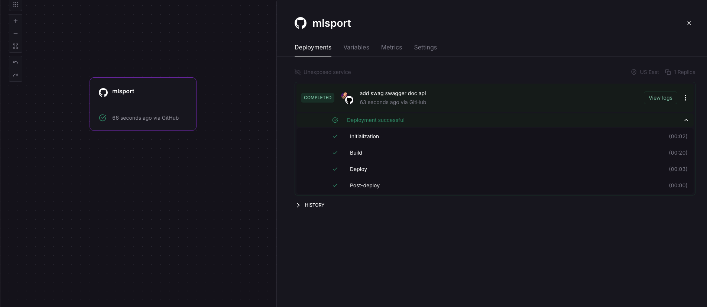
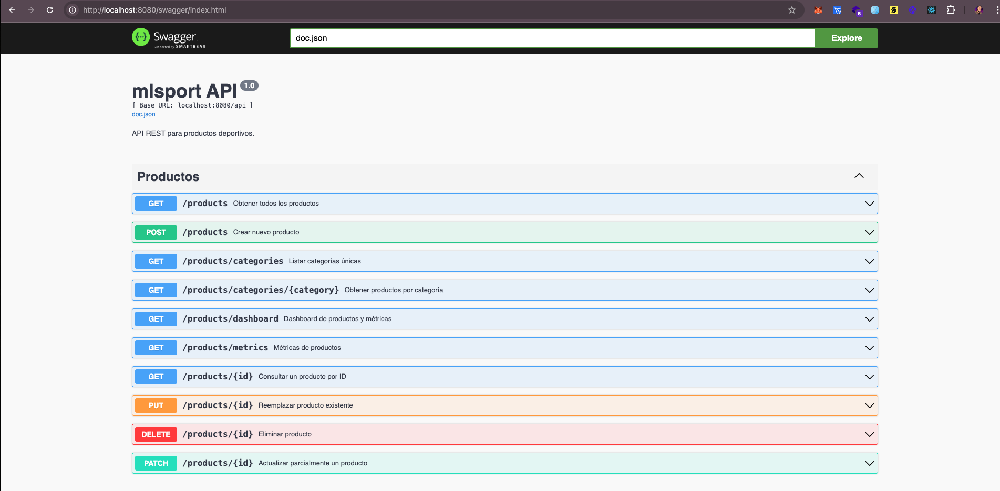

# Prueba Técnica - Tienda de Deporte

API REST en Golang para gestionar productos deportivos.  
Incluye CRUD, métricas.

## Variables de entorno

Se debe renombrar env.txt a .env para que tome las variables de entorno

```bash
  MONGO_URI=
  MONGO_DB_NAME=
```

## Para ejecutar el proyecto

```bash
  make  run
  - Este comando instala lo necesario ejecuta las pruebas unitarias y inicia el servicio el cual esta en :8080
```

# deploy en railway



## Documentación de la API


http://localhost:8080/

## CRUD de Productos Deportivos

Estos se encuentran en la ruta principal /

## Métricas de Productos

se encuentran en el endpoint /api/products/dashboard
